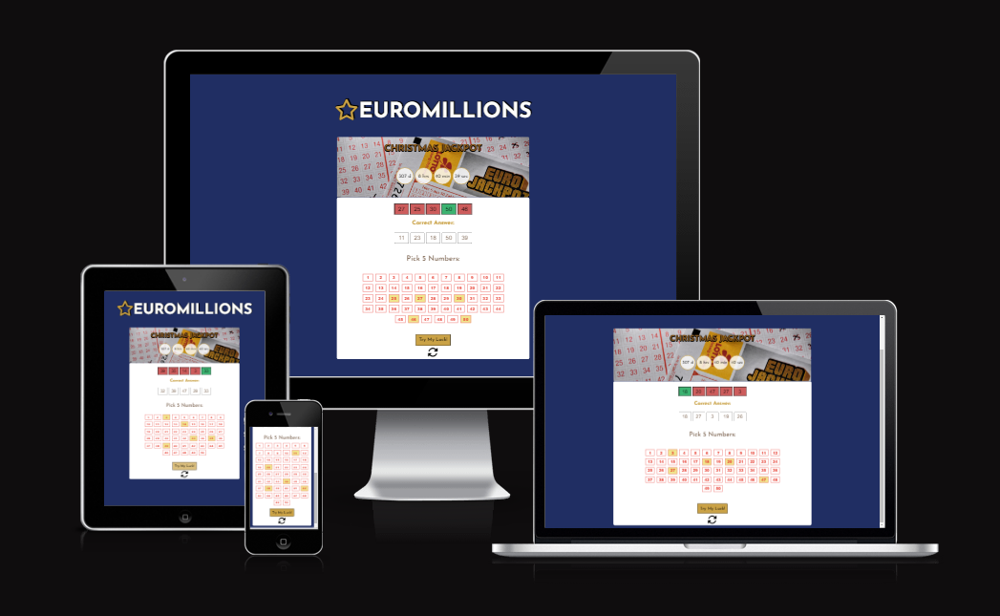
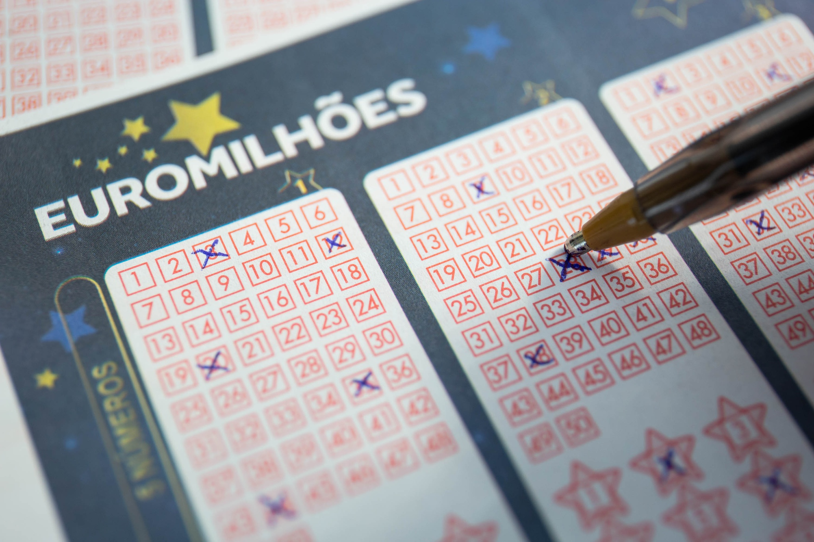

# EUROMILLIONS

## [View Website in Github pages](https)

Euromillions was first launched on February 7th, and the original participating countries were France, the UK, and Spain. This lottery game is deeply ingrained in Portuguese culture, especially in small towns like the one where I grew up.

Despite the game's relatively low cost of €2.50 per ticket, the odds of winning the jackpot with a randomly generated combination of numbers are extremely slim. With a total of 2,118,760 five-number combinations possible, the overall odds of getting the correct numbers are 1 in 95 million. In fact, it would take 100 tickets purchased every week for the next 18,000 years to match those odds!

Nevertheless, the dream of becoming a millionaire is still a powerful draw for many people, regardless of their socio-economic background. This game holds a special place in the hearts of millions, and for this reason, I have created a nostalgic web simulation of the popular lottery game, giving users a chance to test their luck.

# Table of Contents

- [UX](#ux)
    - [Target Audience](#target-audience)
    - [Website owner business goals](#website-owner-business-goals)
    - [User goals](#user-goals)
        - [New user goals](#new-user-goals)
        - [Returning user goals](#returning-user-goals)
        - [Website owner business goals](#website-owner-business-goals)
    - [Structure of the website](#structure-of-the-website)
    - [Wireframes](#wireframes)
    - [Surface](#surface)
        - [Color](#colors)
        - [Fonts](#fonts)
        - [Images](#images)
- [Features](#features)
    - [Nav Bar](#navigation-bar)
    - [The Landing Page](#the-landing-page)
    - [First Section and Aside](#first-section--recipes-and-aside-section)
    - [Second Section](#second-section--sneak-peek-into-my-classroom)
    - [Footer](#footer)
    - [Recipes page](#recipes-page)
    - [Life As A Pastry Student](#life-as-a-pastry-student)
    - [About Page](#about-page)
    - [Contact Page](#contact)
- [Features Left to Implement](#features-left-to-implement)
- [Testing](#testing)
    - [Validator Testing](#validator-testing)
        - [Lighthouse](#lighthouse)
        - [W3C](#w3c-html)
        - [Jigsaw](#jigsaw-css)
    -[Responsiveness](#responsiveness)
- [Fixed Bugs](#fixed-bugs)
- [Deployment](#deployment)
- [Credits](#credits)
- [Acknowledgments](#acknowledgements)

# UX

## User Goals
- Play a simulation of a classical loterry game.
- Try to have as much numbers guessed correctly.

## Site Owner Goals
- Creating a web version of this lottery game. (In the future users can be registered and tickets can be bought directly)
- The game should be easily accessesible and be able to be played on different devices.
- Diferent themes to engage more users to participate.

# User Experience

## Target Audience
- People who like lottery games.
- People of all socio-economic backgrounds.
- People looking for a quick acessment of their luck.

## User Requirements and Expectations
- Intuitive navigation
- Easy to play and recieve the outcome.
- Game with a similar presentation as the classic euromillions game. 

## User Stories
- As a user, I want to be able to quickly access the numbers, submit the answer and have an imidiate result
- As a user, the numbers that i pick i want them to change colors and appear somewhere in a input box.
- As a user, I want to see the correct answer to be able to compare results.
- As a user, I want to know which results are wrong with a different color.
- As a user, I want to have big buttons to click on the mobile version. 

## Site Owner Stories
- As a site owner, besides regular weekly jackpots, I want to engage users by providing big jackpots on special occasions.
- As a site owner, I'd like to encorage users to try different number combinations to test if they have a slightly more probability of guessing the numbers correctly.

## Design
### Design Choices 
The game was inspired on EuroMillion's phisical lottery ticket, for this reason the design choices where made to match the original layout of the game.

### Colour
- Colours were obtained from the above picture using the image color picker.  [(View website)](https://imagecolorpicker.com/)
- From the dark blue background and harm yellow star hex colours was created a color pallete.
### Fonts
- The Fonts used were trying to match as closely as possible the familiar original fonts of the lottery.

### Structure
- The structure was designed so that it would appear in the center on different diveces.
- Contains a similar structure of the buttons and a white background with slithly rounded corners.

## Technologies Used

### Languages
- HTML
- CSS
- JavaScript

### Tools
- Git
- GitHub
- Gitpod
- Paint
- Font Awesome
- Favicon
- JSHint
- Lighthouse
- W3C Markup validation service
- W3C Jigsaw CSS validation service 

## Features

### Header
 -Game logo with the similar family-font and a text shadow with a hover effect, lightenning to yellow colour.

ScreenShot- Title

