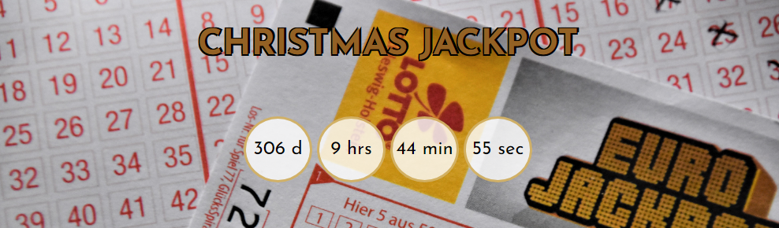
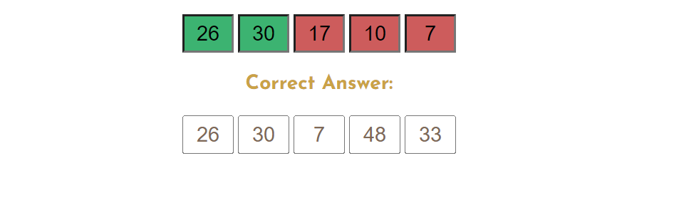
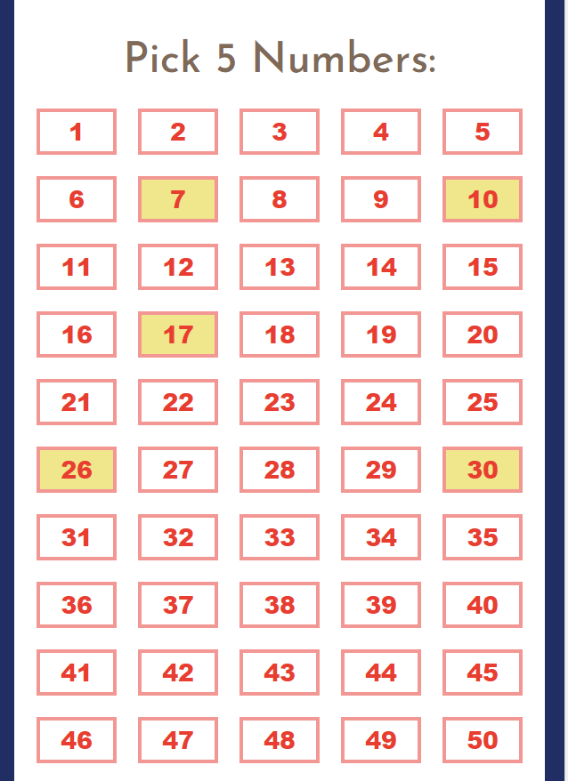
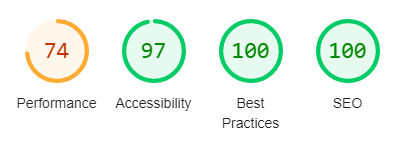
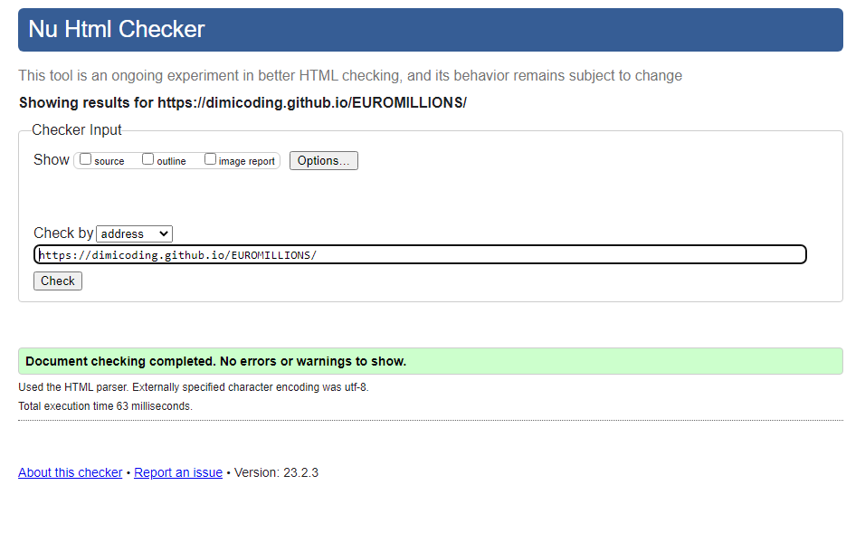
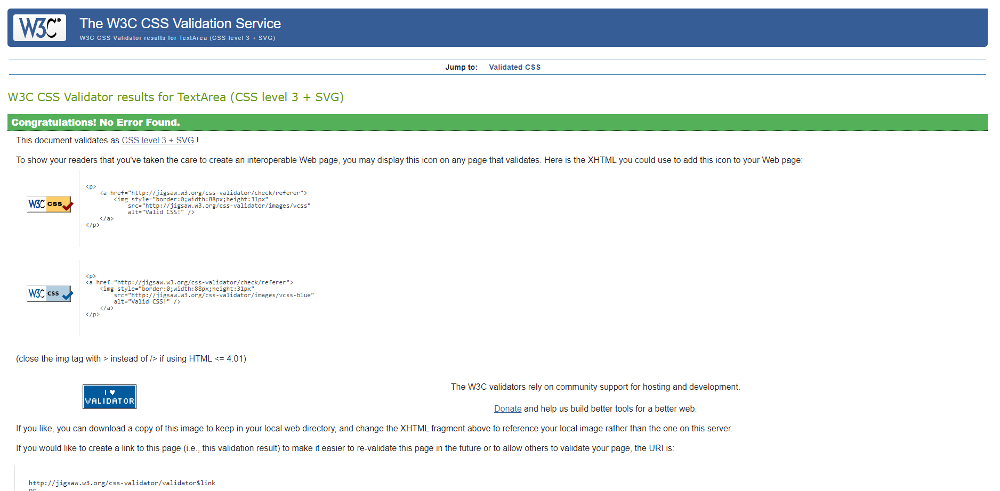
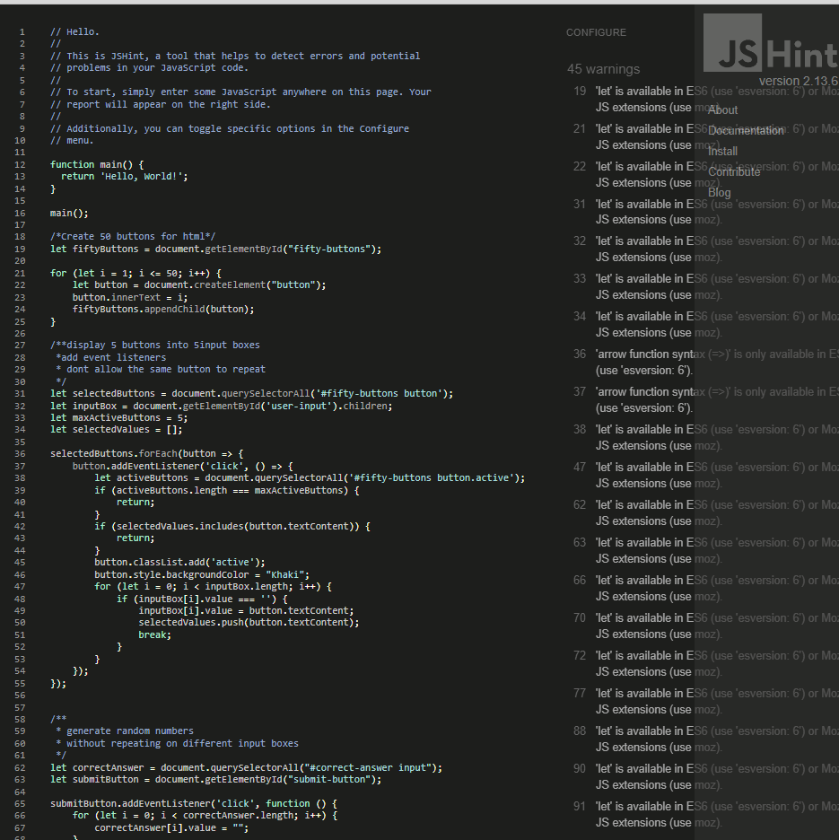

# EUROMILLIONS

## [View Website on GitHub pages](https://dimicoding.github.io/EUROMILLIONS/)

Euromillions was first launched on February 7th, and the original participating countries were France, the UK, and Spain. This lottery game is deeply ingrained in Portuguese culture, especially in small towns like the one where I grew up.

Despite the game's relatively low cost of €2.50 per ticket, the odds of winning the jackpot with a randomly generated combination of numbers are extremely slim. With a total of 2,118,760 five-number combinations possible, the overall odds of getting the correct numbers are 1 in 95 million. In fact, it would take 100 tickets purchased every week for the next 18,000 years to match those odds!

Nevertheless, the dream of becoming a millionaire is still a powerful draw for many people, regardless of their socio-economic background. This game holds a special place in the hearts of millions, and for this reason, I have created a nostalgic web simulation of the popular lottery game, giving users a chance to test their luck.

# Table of Contents

- [UX](#ux)
    - [User Goals](#user-goals)
    - [Site Owner Goals](#site-owner-goals)
- [User Experience](#user-experience)
    - [Target Audience](#target-audience)
    - [User Requirements and Expectations](#user-requirements-and-expectations)
    - [User Stories](#user-stories)
    - [Site Owner Stories](#site-owner-stories)
- [Design](#design)
    - [Design Choices](#design-choices)
    - [Colour](#colours)
    - [Fonts](#fonts)
    - [Structure](#structure)
- [Technologies Used](#technologies-used)
    - [Languages](#languages)
    - [Tools](#tools)
- [Features](#features)
    - [Header](#header)
    - [Jackpot Timer](#jackpot-timer)
    - [User Input and Correct Answer Box](#users-input-and-correct-answer-boxes)
    - [Numbers](#numbers)
    - [Submit and Retry Buttons](#submit-and-retry-buttons)
- [Testing](#testing)
    - [Validator Testing](#validator-testing)
        - [Lighthouse](#lighthouse)
        - [W3C HTML Validator](#w3c-html-validator)
        - [Jigsaw CSS Validator](#jigsaw-css-validator)
        - [Java Script Validator](#jigsaw-css-validator)
    -[Responsiveness](#responsiveness)
- [Fixed Bugs](#fixed-bugs)
- [Deployment](#deployment)
- [Credits](#credits)
- [Acknowledgments](#acknowledgements)
    

# UX

## User Goals
- Play a simulation of a classical lottery game.
- Try to guess as many numbers correctly as possible.

## Site Owner Goals
- Create an online version of the lottery game. (In the future users can be registered and tickets can be bought directly)
- The game should be easily accessible and be able to be played on different devices.
- Diferent themes to engage more users to participate.

# User Experience

## Target Audience
- People who enjoy playing lottery games.
- People of all socio-economic backgrounds.
- People seeking a quick assessment of their luck.

## User Requirements and Expectations
- Intuitive navigation
- Easy to play and receive the results.
- Game with a similar presentation as the classic Euromillions game. 

## User Stories
- As a user, I want to be able to quickly access the numbers, submit the answer, and have an immediate result.
- As a user, the numbers that I pick I want them to change colors and appear somewhere in an input box.
- As a user, I want to see the correct answer to be able to compare results.
- As a user, I want to know which results are wrong with a different color.
- As a user, I want to have big buttons to click on the mobile version. 

## Site Owner Stories
- As a site owner, besides regular weekly jackpots, I want to engage users by providing big jackpots on special occasions.
- As a site owner, I'd like to encourage users to try different number combinations to test if they have a slightly more probability of guessing the numbers correctly.

## Design
## Design Choices 
The game was inspired by EuroMillion's physical lottery ticket, for this reason, the design choices were made to match the original layout of the game.

## Colour
- Colours were obtained from the above picture using the image color picker.  [(View website)](https://imagecolorpicker.com/)
- From the dark blue background and harm yellow star hex colors were created as a color palette.
## Fonts
-The fonts used are meant to match the original fonts of the lottery's as closely as possible.

## Structure
- The structure was designed so that it would appear in the center on different devices.
- It contains similar buttons and a white background with slightly rounded corners.

# Technologies Used

## Languages
- HTML
- CSS
- JavaScript

## Tools
- Git
- GitHub
- Gitpod
- Paint
- Font Awesome
- Favicon
- Lighthouse
- W3C Markup validation service
- W3C Jigsaw CSS validation service 
- JSHint

# Features

## Header

- The game logo features a font similar to the original.
- The text shadow has a hover effect, lighting up to a yellow color.

ScreenShot- Title

 

 ## Jackpot Timer
- Remaining time for the jackpot happening on Christmas eve 2023.
- Timer is set to repeat itself after for the next Christmas eve.
- Background image serves to identify the ticket style of the lottery game.

ScreenShot-Jackpot timer

 

 ## User's Input and Correct Answer Boxes
- Numbers picked will appear on the first input box line.
- The user is limited to five numbers only, and each number can only be selected once.
- The correct answer box shows the correct numbers generated randomly.
- Correct numbers are highlighted in green and incorrect ones in red.

ScreenShot-User's Input and Correct Answer Boxes

 

 ## Numbers
- 5 buttons can be picked out of a total of 50.
- Numbers picked by the user will turn active with the yellow color.

ScreenShot-Numbers

 

 ## Submit and Retry Buttons
- Submit button, named: "Try My Luck!", compares the user's input with randomly generated 5 numbers.
- The retry button, clears out the user's numbers and the correct answer. Allowing the user to restart a new try.

ScreenShot-Submit and Retry Buttons

 

# Testing

## Validator Testing

### Lighthouse
The google lighthouse testing in chrome developer tools shows:
- Lowest score represents the performance parameter with 74%.
- Accessibility, Best Practices, and SEO scores ranging from the highest scores.

ScreenShot-Lighthouse

 

### W3C-HTML Validator
HTML passed the validator with no errors or warnings to show.

ScreenShot-W3C-HTML Validator

 

### Jigsaw CSS Validator
CSS file passed the validator with no errors or warnings to show.

ScreenShot-Jigsaw CSS Validator

 

### JavaScript Validation
To test the JavaScript file JShint was used. Warnings of the same character were shown. Other than that no errors were shown.

ScreenShot-JavaScript Validation

 

## Responsiveness
The website page is responsive and tested on different browsers: Microsoft Edge, Chrome, Opera GX, and Mi(phone-Xiaomi). The following media queries were used:

- @media (min-width: 1281px)

- @media (min-width: 1025px) and (max-width: 1280px) 

- @media (min-width: 768px) and (max-width: 1024px) 

- @media (min-width: 481px) and (max-width: 767px) 

- @media (min-width: 320px) and (max-width: 480px)

# Fixed Bugs

- Many issues occurred along the journey using JavaScript, some ideas like creating an additional 1-12 star section buttons with two more options of choice for the user had to be left out.
- Making the buttons of the number section change color, and be outputted into the user-input section took almost two days of troubleshooting until I found the solution to use the .active when the button is pressed.
- Comparing the chosen numbers from the users-input with randomly generated numbers was causing errors and most of the time nothing would happen. I found the solution by going through the love maths project, the main issue is that I wasn't comparing the same values(string-number), so parseInt played a key role.
- Many other bugs wouldn't be solved without the use of other sources mentioned in the credits section.

# Deployment
For this project, I used the Gitpod browser as a development environment from where I committed and pushed my last changes to my repository in GitHub.

To deploy the project first I had to do:
- Go to the GitHub repository EUROMILLIONS.
- Navigate to the Settings tab.
- Select the main branch and save.
- In one minute and after refreshing my browser the link has been successfully deployed.

To ensure that the link was up to date and running smoothly I opened the link from the nav function called "actions".

The live link can be found here - https://dimicoding.github.io/EUROMILLIONS/

# Credits

- Some basic functions to support javascript files like parseInt issue mentioned from the Love Maths project(Code Institute)

- Numbers section was inspired by the Euromillions official lottery website: https://www.giantlottos.com/free-euro-promo?affid=6079b996719ae&bid=c46fab89

- Stack overflow was used on various occasions. The problem with selecting users input and making the button change colors with .active was influenced on https://stackoverflow.com/questions/64124390/change-button-color-and-making-it-active-when-clicked

- Reveal random numbers, youtube: https://www.youtube.com/watch?v=uNquzKIStAo

- Design was mainly "cloned" from the original EuroMillions lottery game. 

- Favicon was downloaded from: https://icons8.com/icons/set/favicon-star

- Fonts used from google fonts https://fonts.google.com/

- Code institute's template: https://github.com/Code-Institute-Org/gitpod-full-template

- Media queries range inspired by https://gist.github.com/gokulkrishh/242e68d1ee94ad05f488

- Background image containing the "timer" belongs to Pexels.

- Readme file inspired on: https://github.com/4n4ru/CI-P2-GuessingBee and https://github.com/marcin-kli/MP1/blob/Milestone-Projects/README.md#user-stories-testing .

# Acknowledgements
- To the whole Team at Code Institute.
- Thanks to my mentor Adegbenga Adeye for the feedback, encouragement, and disponibility.
- Thanks to Paul Thomas O’Riordan,  Cohort Facilitator of the weekly SUP for sharing useful tips and material.

 

[Back To Table of Contents](#table-of-contents)